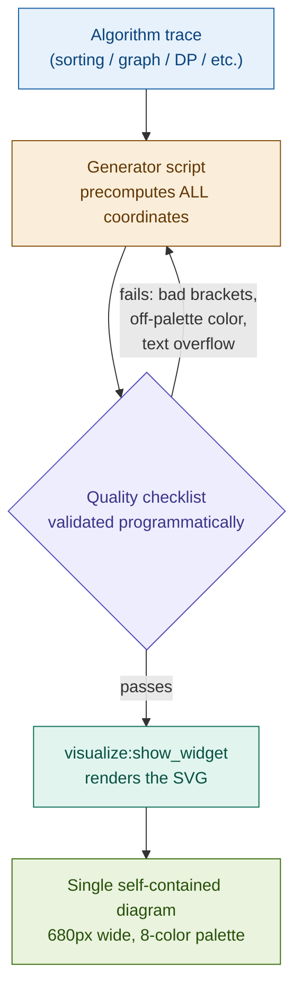

# DSA Visualizer

A custom Claude skill that turns any Data Structures & Algorithms trace — sorting, graphs, trees, DP, two-pointer, backtracking — into a single, self-contained SVG diagram with a consistent visual design system, so every output looks like it came from the same tool no matter which algorithm it's illustrating.

---

## Why I built this

Most AI-generated algorithm diagrams are one-offs: different color logic, different spacing, different levels of detail every time you ask. That makes them useless as a *study series* — nothing looks related, and nothing is reusable as a reference.

I wanted the opposite: a fixed design system that behaves like a real diagramming tool. Same canvas rules, same color semantics, same typography, same layout conventions — every single time, regardless of whether the algorithm is counting sort or Dijkstra's shortest path. The goal is a visual language you learn once and then read fluently across every DP table, every graph relaxation, every backtracking tree, for as long as you're studying.

## How it was built

Rather than writing the design system from imagination, I reverse-engineered it from ground truth. I generated 10 real diagrams across a deliberately wide spread of DSA topics — counting sort, Floyd–Warshall, Kruskal's MST, matrix chain multiplication DP, Floyd's cycle detection, monotonic stacks, Dijkstra, N-ary tree diameter, apple-collection tree DP, and two-pointer subsequence checks — then did a forensic pass over the actual SVG output: exact hex values, exact corner radii, exact spacing between rows, exact font sizes. Every rule in the skill is a measured value from that reference set, not a guess. Those 10 files now ship inside the skill as a reference library that future diagrams are matched against directly.

## What it enforces

**A fixed canvas contract.** Every diagram is exactly 680px wide — never wider, regardless of how crowded a row looks. Only height scales, from a ~700px counting-sort trace to a ~3,900px apple-collection trace. This one constraint is what keeps every diagram feeling like part of the same set instead of a random one-off.

**A closed color vocabulary.** Eight semantic colors, each a pastel fill paired with a saturated stroke of the same hue and a darker "text-on-fill" variant — blue for structure and current pointers, green for sorted/finalized state, amber for in-progress comparisons, red for conflicts and cycles, and so on. No ad hoc hex values are ever introduced; the skill's quality checklist rejects anything outside the defined set.

**Deliberate pedagogy, not just illustration.** DP diagrams show the losing options next to the winning one, not just the final answer. Recurring structures — a stack, a queue, a cycle-closing pointer — are redrawn in every row they're relevant to, not shown once and implied thereafter. First occurrences of a step pattern get full explanatory detail; later repeats compress to a short label so the diagram doesn't bloat. Cross-phase arrows only ever connect consecutive states — never skip, never jump backward — so the diagram can be read top to bottom like a proof, not decoded like a puzzle.

**A generate → validate → render pipeline**, not a one-shot draw. Coordinates are precomputed programmatically before any SVG is written, the output is checked against a quality checklist (unclosed bracket labels, text overflow, off-palette colors, non-standard corner radii) before it's ever shown, and complexity is scaled up across a session so the tenth diagram in a study sitting is visibly more ambitious than the first.

## Pipeline



Nothing is hand-drawn or eyeballed — coordinates, colors, and label text are all computed and checked before a single SVG tag is rendered.

## File structure

The skill ships as a self-contained folder: one instruction file plus a library of real, validated reference outputs it matches new diagrams against.

```
dsa-visualizer/
├── SKILL.md                                        # Design system + mandatory workflow
│                                                    #   (canvas rules, color table, typography,
│                                                    #    layout rules, quality checklist)
│
└── references/                                     # 10 real, validated SVG outputs
    ├── test1_counting_sort_.svg
    ├── test2_floyd_warshall.svg
    ├── test3_kruskals_mst.svg
    ├── test4_matrix_chain_with_dp_tables.svg
    ├── test5_floyd_cycle_detection_linked_list.svg
    ├── test6_monotonic_stack_next_greater_element.svg
    ├── test7_dijkstra_shortest_path.svg
    ├── test8_n-ary_tree_diameter.svg
    ├── test9_min_time_collect_apples.svg
    └── test10_skip_one_char_subsequence_two_pointer.svg
```

`SKILL.md` is the contract — every color hex, spacing value, and corner radius was measured directly from the files in `references/`, not reconstructed from memory. When a new diagram is requested, the closest-matching reference is opened first and its layout is copied rather than re-derived from the rules alone, which is why the output stays consistent across topics it's never seen before.

## How to use it

1. **Get the skill onto your machine.** Clone or download the zip from the repo, then unzip it — you'll get the `dsa-visualizer/` folder shown above with `SKILL.md` and `references/` intact.
2. **Place it where Claude looks for skills.** Drop the whole `dsa-visualizer/` folder into your skills directory (e.g. `/mnt/skills/user/dsa-visualizer/` in a Claude environment with filesystem access, or wherever your setup registers user skills). Keep `SKILL.md` and `references/` together — the skill resolves the reference folder relative to itself, never as a hardcoded path.
3. **Invoke it naturally.** No slash command is required — just ask to visualize, draw, diagram, or trace through any DSA topic: *"visualize Dijkstra's algorithm on this graph"*, *"draw the DP table for longest common subsequence"*, *"trace this two-pointer solution."* The skill's description is written to auto-trigger on that kind of request.
4. **Hand it a problem.** Paste code, describe the algorithm, or name a LeetCode-style problem. The skill precomputes the trace, generates the SVG, validates it against the checklist, and renders it inline — no intermediate script output, no manual coordinate placement.
5. **Keep going in the same session for a study series.** Complexity is designed to scale up across a session, so asking for several diagrams back-to-back (e.g. working through a DP problem set) produces a progressively more ambitious set rather than repetitive, same-size outputs.

## Validated on

The rebuilt workflow was tested end-to-end on a C++ dynamic programming trace — `getMaxLen`, the longest subarray with a positive product — confirming the pipeline renders an actual SVG through `visualize:show_widget` rather than stopping at intermediate script output, which was the specific failure mode the last revision fixed.

## Result

A visualization tool that behaves like infrastructure, not a novelty: point it at any DSA topic and get back a diagram that's immediately legible as part of the same series as the last fifty, with the pedagogical choices (what to highlight, what to keep visible, what to compress) baked into the system rather than re-decided from scratch every time.
